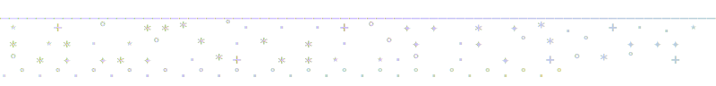
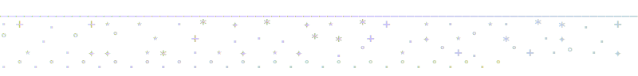
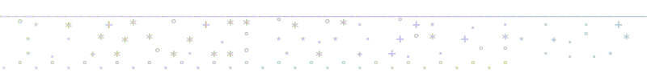
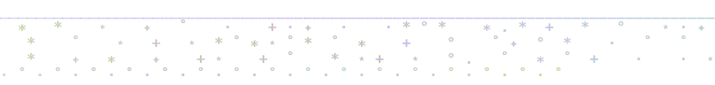
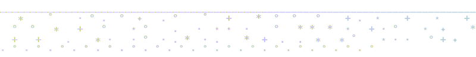
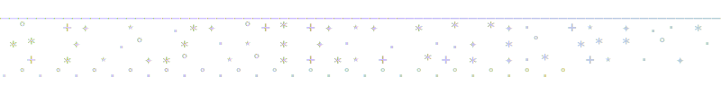
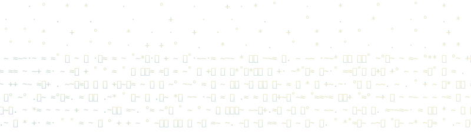

<p align="center">
  
</p>

<!-- add signature.svg to ./assets/ -->

<h1 align="center">bird</h1>

<p align="center">fast cli for twitter/x. built by <a href="https://x.com/steipete">@steipete</a>. mirrored here so it stays accessible.</p>

<p align="center">
  
  
  
</p>

<p align="center">
  <a href="#what-it-does">what it does</a> · <a href="#install">install</a> · <a href="#usage">usage</a> · <a href="#use-with-ai-agents">ai agents</a>
</p>

<br>
<br>

<p align="center">
  
</p>

<br>
<br>

## what it does

bird is a cli for reading and posting on twitter/x. no api keys. no oauth dance. it reads cookies directly from safari or chrome.

the original [steipete/bird](https://github.com/steipete/bird) repo was removed from github. this mirror exists so people who depend on the tool can still get it. all credit for the cli goes to [@steipete](https://x.com/steipete) (Peter Steinberger). i'm just keeping the lights on.

<br>
<br>

<p align="center">
  
</p>

<br>
<br>

## install

```bash
# direct download — universal arm64/x86_64 binary from this mirror
curl -L https://github.com/zaydiscold/bird/releases/download/v0.8.0/bird -o bird
chmod +x bird
sudo mv bird /usr/local/bin/bird
```

or with wget:

```bash
wget -O bird https://github.com/zaydiscold/bird/releases/download/v0.8.0/bird
chmod +x bird
sudo mv bird /usr/local/bin/bird
```

> **note on homebrew:** steipete's tap (`brew install steipete/tap/bird`) was the original install method. i'm not sure if that tap is still maintained — it may be down. use the curl install above to be safe.<br>
> <sub>steipete's original tap: `brew install steipete/tap/bird`</sub>

verify:

```bash
bird whoami  # returns your twitter handle
```

requires being logged into x.com in safari or chrome.

<br>
<br>

<p align="center">
  
</p>

<br>
<br>

## usage

bird auto-detects safari cookies. no setup.

```bash
bird whoami                          # confirm logged-in account
bird check                           # check cookie availability
bird --chrome-profile "Default" ...  # use chrome instead of safari
```

### read

```bash
bird read <url-or-id>                # single tweet
bird thread <url-or-id>              # full conversation thread
bird thread <url-or-id> --all        # thread, all pages
bird replies <url-or-id>             # replies to a tweet
bird user-tweets @handle -n 20       # user's recent tweets
```

### search

```bash
bird search "query" -n 20
bird search "from:@handle keyword" -n 10
bird search "term" --all             # paginate through everything
```

### timeline

```bash
bird home -n 20                      # for you feed
bird home --following -n 20          # following, chronological
bird mentions -n 20                  # your mentions
bird bookmarks -n 20                 # saved bookmarks
bird likes -n 20                     # liked tweets
bird lists                           # your lists
bird list-timeline <list-id-or-url>  # list timeline
bird about @handle                   # account origin and location
bird following -n 50                 # who you follow
bird followers -n 50                 # your followers
```

### post

```bash
bird tweet "text here"
bird reply <url-or-id> "reply text"
bird follow @handle
bird unfollow @handle

# attach media — up to 4 images or 1 video
bird tweet "caption" --media /path/to/image.jpg --alt "alt text"
bird tweet "caption" --media /path/to/video.mp4
```

### output

```bash
bird read <id> --json           # structured json
bird read <id> --json-full      # json + raw api response
bird search "query" --plain     # no color, pipeable
```

<sub>flags: `-n` result count · `--all` paginate · `--following` filter · `--ai-only` curated news · `--with-tweets` include tweets · `--tweets-per-item N` · `--chrome-profile "Name"` · `--json` · `--json-full` · `--plain` · `--media path` · `--alt text`</sub>

<br>
<br>

<p align="center">
  
</p>

<br>
<br>

## use with ai agents

for claude code, cursor, codex, and other ai agents: **[zaydiscold/bird-skill](https://github.com/zaydiscold/bird-skill)**

i built the skill myself. paste any x.com link into a claude code session and it reads the tweet directly — no browser, no webfetch. it also handles timelines, search, posting, all of it. homegrown, built to work on top of peter's binary.

```bash
npx skills add zaydiscold/bird-skill@bird -g -y
```

<br>
<br>

<p align="center">
  
</p>

<br>
<br>

<p align="center">
  <a href="https://star-history.com/#zaydiscold/bird&Date">
    <picture>
      <source media="(prefers-color-scheme: dark)" srcset="https://api.star-history.com/svg?repos=zaydiscold/bird&type=Date&theme=dark" />
      <source media="(prefers-color-scheme: light)" srcset="https://api.star-history.com/svg?repos=zaydiscold/bird&type=Date" />
      
    </picture>
  </a>
</p>

<p align="center">mit. <a href="./LICENSE">license</a></p>

<br>
<br>

<p align="center">
  
</p>

<br>
<br>

<p align="left"><strong>zayd / cold</strong></p>

<p align="center">
  <a href="https://zayd.wtf">zayd.wtf</a> · <a href="https://x.com/coldcooks">twitter</a> · <a href="https://github.com/zaydiscold">github</a>
  <br>
  <em>icarus only fell because he flew</em>
</p>

<p align="right">
  <strong>to do</strong><br>
  <sub>
  ☑ mirror binary + release<br>
  ☑ homebrew formula<br>
  ☑ bird-skill for ai agents<br>
  ☐ auto-update check on install
  </sub>
</p>

<br>
<br>
<br>
<br>

<p align="center">
  
</p>
